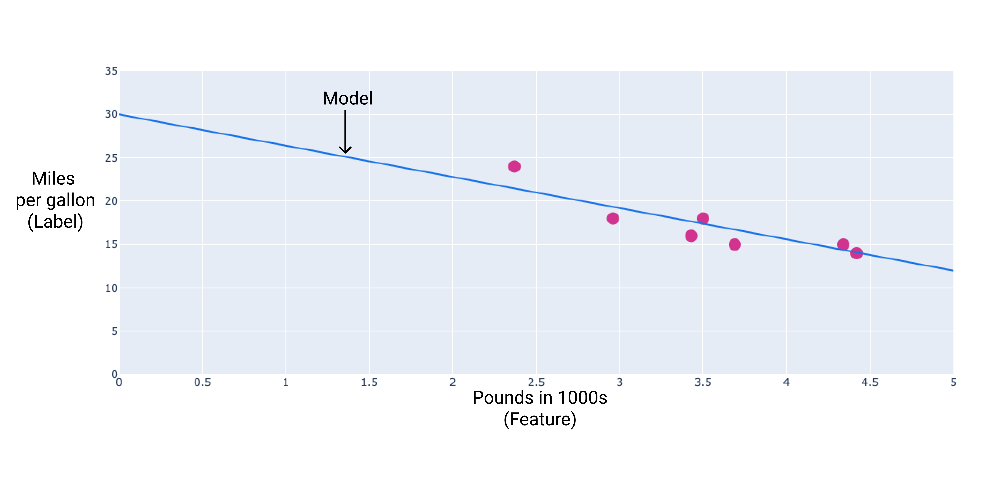

+ Supervised and unsupervised learning are the two primary approaches in artificial intelligence and machine learning. The simplest way to differentiate between supervised and unsupervised learning is how the models are trained and the type of training data the algorithms use. 

+ The biggest difference between supervised and unsupervised machine learning is the type of data used. Supervised learning uses labeled training data, and unsupervised learning does not. 

+ Linear regression is a statistical technique used to find the relationship between variables. In an ML context, linear regression finds the relationship between features and a label.
    
    Linear regression equation
    In algebraic terms, the model would be defined as y = mx + b, where
    y is miles per gallon—the value we want to predict.
    m is the slope of the line.
    x is pounds—our input value.
    b is the y-intercept.

    In ML, we write the equation for a linear regression model as follows:
    
    where:

    y' is the predicted label—the output.
    b is the bias of the model. Bias is the same concept as the y-intercept in the algebraic equation for a line. In ML, bias is sometimes referred to as w0. Bias is a parameter of the model and is calculated during training.
    w1 is the weight of the feature. Weight is the same concept as the slope m in the algebraic equation for a line. Weight is a parameter of the model and is calculated during training.
    x1 is a feature—the input.